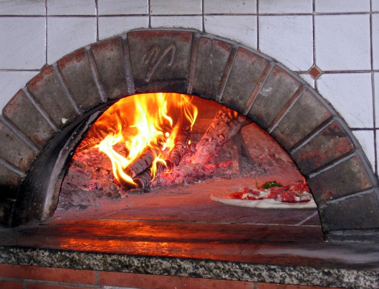

<figcaption class="caption">“Pizza Oven” <a href="https://creativecommons.org/publicdomain/zero/1.0/deed.en">CCO 1.0 Universal</a> by <a href="https://pixabay.com/en/users/skeeze-272447/">skeeze</a></figcaption>

Since kanban originated with the Toyota production system, many Agile coaches and educators like to use an auto production line as the example for why kanban is so efficient and powerful. While the example is valuable and illustrates basic tenants of kanban, many of the implementation details are lost on members of an agile team. Many, if not most IT folks have never worked in a factory setting before. It’s easy to say that if you are out of left rear car doors, the production line stops. But, the impacts on the rest of the production line are harder to grasp. Do the tires go on after the doors or are already on? Are there steps that can take place even without the doors? Without an example grounded in experience, kanban is left as a theory and you may as well be back in Principles of Economics learning a host of abstract ideas. However, most folks have probably worked in a restaurant at one time or, they have watched enough Food Network and Netflix specials to get the idea. In the next few installments, I’ll demonstrate how a small pizza shop uses kanban, albeit unknowingly, to produce great pizza and how you can translate what they do into the work with your dev team.

--- 

Friday night is pizza night at my house and that always means a drive to our favorite Neapolitan pizza place. There they use a 900 degree, wood-fired pizza oven to bake a pie in just about 90 seconds. This isn’t one of those fool-proof conveyor belt contraptions you find at large chains, this oven holds three pies at a time and must be constantly watched. As such, the restaurant must manage their throughput and work in progress (WIP) in a diligent manner to keep up with the demand.

## mise en place

Before writing any code or prioritizing work with the product owner, you and your team need a mise en place, simply, “everything in its place.” Think of this as the core tools that your team needs to develop and deploy software as quickly as possible. This is everything from a getting started guide for new developers, to pre-commit hooks to lint your code, to test coverage, to automated deployments. Without these things, developers spend time configuring their environment to run, manually running tests, and attempting/re-attempting to deploy code for each iteration. Without a developer’s mise en place, they are unprepared, frustrated, slow, and inconsistent.

A restaurant knows that they must prepare everything in advance or else the evening is shot. Each morning and even the day before, they make hundreds of balls of pizza dough, gallons of tomato sauce, and pick bundles of basil. Prior to service, they have containers of salami, olives, burrata, parmesan, artichoke, fresh tomatoes, onion, arugula, prosciutto, ricotta, mushrooms, and more on the line and ready for orders. In the cooler underneath, there are backups upon backups of each. This is also to say that the development team should be prepared to work with the tools they have and team leads should be prepared to guard the team against one off requests that they are not prepared to handle.

## the line (backlog)

As much as it frustrates me, this pizza place rarely takes orders over the phone, nor do they take reservations. When you arrive, you join the line which extends out the door. While in line, you will review the menu, the daily specials, and maybe order a drink from the bar. Maybe while in line you ask the bartender for a suggestion or you look at the back patio to see what kind of space is available. While in the backlog, you are refining your order (user story). By the time you reach the register, you should be able to rattle off exactly what you want and be ready with payment.

While folks are in line the scrum master needs to act in the role of the roving bartender. They need to answer questions, offer suggestions, listen, and ensure that the patrons are ready to order when the time comes.

This concludes the first installment. More to come!